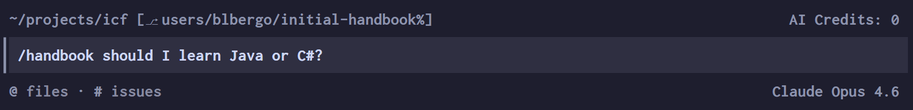

# ICF 2026 Technical Handbook

We are delighted to provide the following technical handbook for anyone interested in learning how to create amazing accessibility-first projects. 

## Documentation

> **Disclaimer**: This repo is authored by at least one Microsoft employee with mixed used of GenAI. The opinions expressed below are that soley of the authors of this repo and do not reflect any views of Microsoft, GitHub, or any other entity.

As part of our goal of introducing industry trends to students, we have attempted to make this repo as agent and user-friendly as possible. The documentation is organized into an agent skill, which you can browse [here](.github/skills/handbook/references), or inquire about using your coding agent of choice. If you have never used a coding agent before, checkout these solutions:
- [Copilot CLI](https://github.com/features/copilot/cli)
- GitHub Copilot for Visula Studio and VS Code
- the new [GitHub Copilot App](https://github.com/features/ai/github-app)

The skill can be invoked the same way across all 3 tools as shown below:

## Sample: bg-dashboard

`bg-dashboard` is a full-stack sample that lives under `samples/bg-dashboard`.

It includes a persisted dashboard prediction panel that uses uploaded CSVs as the saved prediction source.

See `samples/bg-dashboard/README.md` for setup and usage.

## Sample: blinkers

`blinkers` is a .NET 8 console app that lives under `samples/blinkers`.

It uses the Microsoft Agent Framework and a strategy-pattern provider system to summarize local files or URLs in a focused, less overwhelming way — inspired by the blinkers horses wear to stay focused on what's ahead.

Features include:
- 🐴 Interactive terminal REPL and batch mode (`--input` flag)
- 🔌 Swappable AI providers: **GitHub Copilot** or **Azure AI Foundry**
- 🎨 Four summary styles: bullets, paragraph, ELI5, executive
- ⚙️ Configurable via `appsettings.json` with CLI flag overrides

See `samples/blinkers/README.md` for setup and usage.